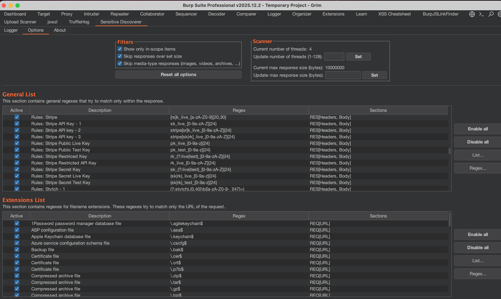

# Sensitivity Discovery – Extended Ruleset

## Overview

This repository provides an extended set of custom rules for the **Sensitivity Discovery** https://portswigger.net/bappstore/81e073a640964b2ea3af0da93d048dbd plugin.

The goal of this project is to improve **on-the-fly detection of sensitive data** within source code and configuration files across diverse technologies and formats.

These rules are intended to help security engineers, AppSec teams, and auditors identify potential data exposure early — before it becomes an incident.

---

## What This Repository Adds

Compared to the default Sensitivity Discovery ruleset, this extension introduces:

- Additional detection rules for sensitive data patterns
- Improved coverage of non-standard and auxiliary file types
- Enhanced visibility into hidden or overlooked configuration artifacts
- Practical rules based on real-world monitoring and analysis

The rules are optimized for fast execution and real-time feedback during analysis.

---

## Use Case & Real-World Context

During continuous monitoring (hirdman.pro) of a client’s public exposure surface, no leaked credentials or datasets were found in known breach sources.

However:
- An overlooked **subdomain** was identified
- The **Sensitivity Discovery plugin**, enhanced with this ruleset, was used during analysis
- Within minutes, the plugin revealed access paths and artifacts that exposed a **complete internal structure** of a large financial environment

This case demonstrated that:
> The absence of leaked data does **not** equal the absence of risk.

Misconfigured or forgotten components, when combined with advanced detection tooling, can unintentionally disclose critical architectural information.

A detailed article describing this process and methodology will be published shortly.

---

## Why This Matters

Traditional secret scanning often focuses only on:
- Hardcoded credentials
- Obvious tokens or keys

This project expands that view by detecting:
- Structural indicators
- Sensitive configuration patterns
- Contextual data that enables further access or pivoting

Such findings are especially critical for:
- Financial institutions
- Large enterprises
- Legacy or fast-growing infrastructures

---

## Installation

1. Clone the repository:
```bash
git clone https://github.com/your-repo/sensitivity-discovery-extended-ruleset.git
2. Import rules in plugin
---
rules based on Based on https://mazinahmed.net/blog/secrets-patterns-db/ project
